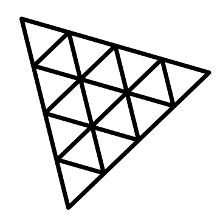

<section style="font-family: 'Montserrat'"><h1>👋 I am ALEX, a FullStack developer.</h1>

<h2>I  to build interesting apps with gamified UI that help provide an improved UX !</h2>
 

<h3 dir="auto">My preferred 

  Play Tools (aka. Tech Stack) so far include:</h3>
 

<code style="display:flex">

</code>
     
 <code style="display:flex" >
  
  
  </code>
  <code style="display:flex" >
  
</code>

Here are some 
  Toys that I am curious about now:

🎲 Currently working on <a href="https://github.com/alexviladev/TAMAGOCHI-CREATOR">
  TAMAGOCHI CREATOR</a> : a personal project using React Native driven by my interest in learning and improving my gamification skills, in order to be able to implement better gamified functionalities throughout my professional projects.

🥋 Besides coding, my other passion is martial arts. I am a 10 year practicioner of Wing Chun, to which I owe much of my personal growth.

If you'd like to work with me find me in <a>Linkedin!</a>
</section>
